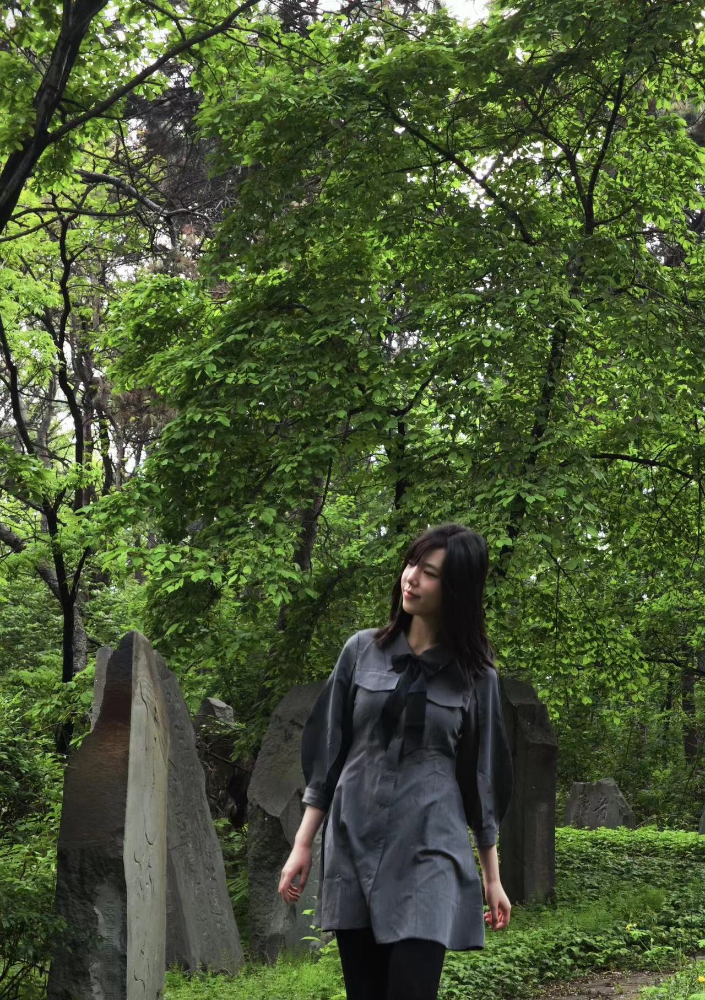

# About Me

Here is **Nova X (Nuwa Xi, 席奴瓦)**.

I am a graduate student at [SCIR](http://ir.hit.edu.cn/) lab at HIT(Harbin Institute of Technology), advised by [Sendong Zhao](https://scholar.google.com/citations?user=ZtIhRvwAAAAJ&hl=zh-CN) and [Ting Liu](https://scholar.google.com/citations?user=zyMJ1V0AAAAJ&hl=zh-CN&oi=ao). Prior to my graduate, I received my bachelor degree from HIT. My research interests include Cognitive-related/inspired NLP and MedNLP/BioNLP.

Feel free to contact me through email ;)

## News and Updates

- **[News] I am looking for a Summer Research Intern Position (from June to Sep)!**
- **May 2023：**My paper [**UniCoRN: Unified Cognitive Signal ReconstructioN bridging cognitive signals and human languages**] has been accepted to ACL2023!
- **May 2023：**Our open-source Chinese Medical LLM [Huatuo/Bencao](https://github.com/SCIR-HI/Huatuo-Llama-Med-Chinese) has received 2.7k+ stars on github!
